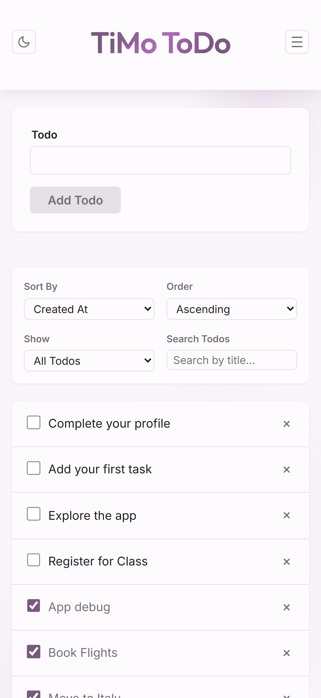
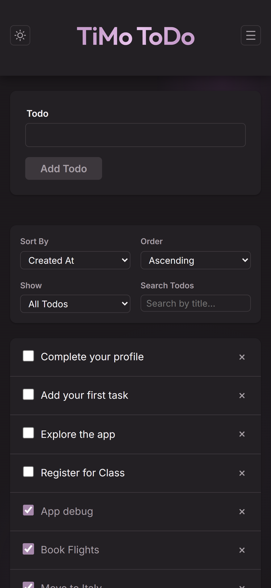
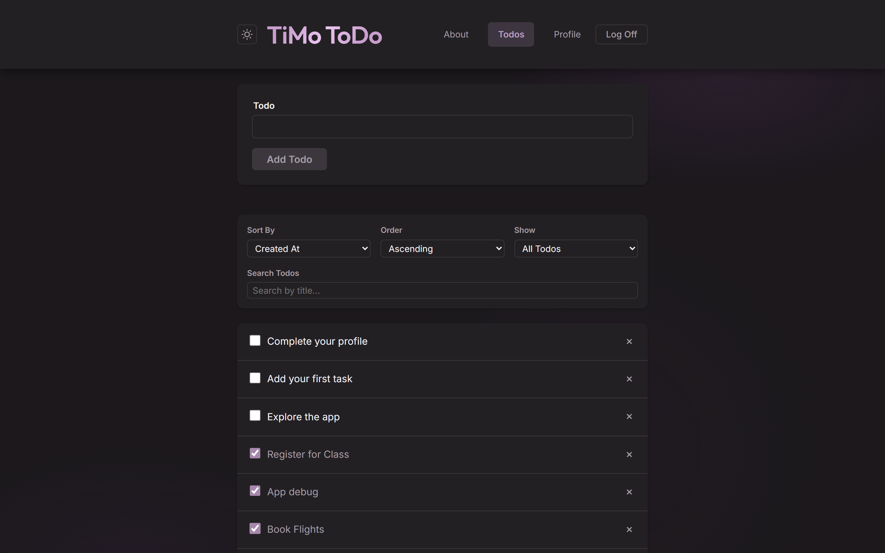
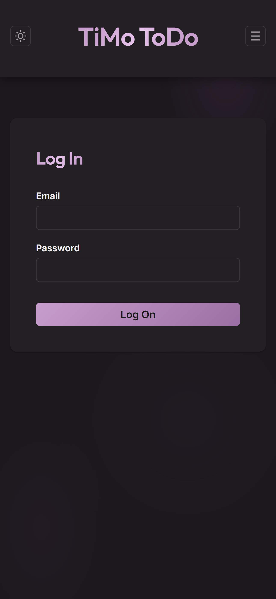
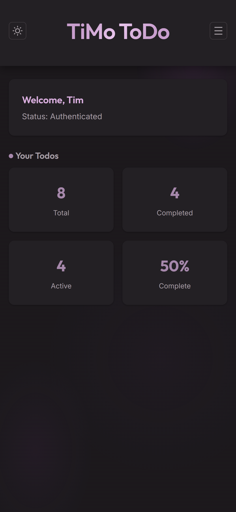

# TiMo ToDo

A todo list application built as part of [Code the Dream's](https://codethedream.org/) React curriculum, within their full-stack web development program. This project demonstrates proficiency in React, state management, routing, authentication, and responsive design, built independently on top of a course-provided assignment scaffold.

## 🚀 Live Demo

[View Live Application](https://react-class-todo-list.vercel.app)

> Note: Full functionality (adding, editing, and managing todos) requires logging in, which is tied to Code the Dream's shared account system. The screenshots below show the authenticated experience, including light/dark mode and mobile/desktop views.

## ✨ Features

### Authentication

- Secure login and logout with session-based authentication
- Protected routes that redirect unauthenticated users to login, then return them to their originally intended page after signing in
- Client-side input validation with generic, non-revealing error messages

### Todos

- Create, edit, complete, and delete todos
- Sort todos by creation date or title, ascending or descending
- Search todos by title
- Filter by status (all, active, completed) — reflected in the URL for bookmarkable, shareable views
- Active todos are grouped ahead of completed ones for easier scanning when viewing all todos
- Optimistic UI updates with automatic rollback if a request fails

### User Experience

- Light and dark mode, with system preference detection and persistence across visits
- Fully responsive, mobile-first layout
- Profile page with account info and todo statistics (total, active, completed, completion percentage)
- Custom 404 page with navigation back to key parts of the app
- Accessible focus states and labels throughout

## 🛠️ Technologies Used

- **Frontend:** React, React Router, CSS Modules
- **State Management:** useReducer, Context API (authentication, theme)
- **Build Tool:** Vite
- **Deployment:** Vercel
- **Backend:** Provided by Code the Dream (Node.js/Express API)

## 📸 Screenshots

### Todos — Light & Dark Mode (Desktop)

<table>
  <tr>
    <td></td>
    <td></td>
  </tr>
</table>

### Responsive Design — Mobile & Desktop

<table>
  <tr>
    <td></td>
    <td></td>
  </tr>
</table>

### Login



### Profile



## 🏗️ Running Locally

Requires [Node.js](https://nodejs.org/) v18 or later.

1. Clone the repository:

```bash
   git clone https://github.com/tcmorrison56/React-class-todo-list
   cd React-class-todo-list
```

2. Install dependencies:

```bash
   npm install
```

3. Start the development server:

```bash
   npm run dev
```

4. Open the local URL shown in your terminal (typically `http://localhost:5173`) in your browser.

> **Note:** This app is built on top of Code the Dream's shared backend API rather than a backend of my own. Locally, API requests are forwarded to that backend through Vite's dev server proxy; in production, the same forwarding is handled by a `vercel.json` rewrite rule. Because of this, login and todo functionality depend on that backend remaining available — this app doesn't include or run its own backend server.

## 📜 Available Scripts

- `npm run dev` — starts the development server with hot module reloading
- `npm run build` — builds the app for production
- `npm run preview` — locally previews the production build
- `npm run lint` — runs ESLint across the project

## 🎨 Design Decisions

### Styling Approach

I used **CSS Modules** for styling. It required no additional setup beyond what Vite already provides, worked with CSS knowledge I already had, and avoided the global naming-conflict issues of plain CSS. The main tradeoff is some duplication of small, shared rules across similar components, since CSS Modules doesn't offer a lightweight way to share styles between files the way other approaches do. For a project this size, that felt like a reasonable compromise.

Every color, spacing value, font size, and shadow in the app is defined once as a CSS custom property and reused everywhere, rather than hardcoded per-component. This made it possible to build a full light/dark theme system, and a global palette adjustment (like the accent color) only ever requires a change in one file.

### Visual & UX Philosophy

Todo apps can easily feel stressful — red badges, urgent colors, cluttered lists. I aimed for what I started calling "energetic calm": a mostly monochrome palette built around a single muted plum accent color, kept deliberately restrained so color always signals something meaningful (an action, an active state) rather than just decorating the page. Background gradients, gradient-text headings, and tinted hover states extend that same accent throughout the app in a controlled way, rather than relying on multiple competing colors.

A few smaller, deliberate choices:

- **Within the "All" filter view, active todos are ordered ahead of completed ones**, rather than mixed together in creation order. Users can still filter to see only Active or only Completed via the status dropdown — this ordering is specifically about making the combined "All" view easier to scan. I initially considered a version with separate section headings and per-section empty states, but it added real complexity for a fairly small visual benefit; simply reordering the existing list achieves the same clarity with far less code.
- **The 404 page links to protected routes (`/todos`, `/profile`) even when logged out.** Since the app's `RequireAuth` component preserves the originally intended destination and redirects back after login, showing these links gets a lost user to where they want to go faster than hiding them would.
- **The app is mobile-first**, built around a single `768px` breakpoint. Layouts and typography start from the mobile case and are enhanced for larger screens, rather than the reverse.

### Architecture

- **Context + useReducer, not one global state library.** Authentication and theme are handled with React Context (`AuthContext`, `ThemeContext`), since they're accessed from many unrelated components. Todo state uses `useReducer`, since it involves multiple related values (loading, error, sort, filter, the list itself) that need to change together in coordinated, predictable ways — a good fit for the reducer pattern over several separate `useState` calls.
- **Optimistic updates with rollback.** Adding, completing, editing, and deleting a todo all update the UI immediately, then roll back to the previous state if the server request fails. This keeps the app feeling fast without sacrificing correctness.
- **Client-side input validation**, including required-field checks and character limits, is applied to todo titles and account fields. Server-side validation and data handling is the responsibility of Code the Dream's provided backend.

## 🔭 Future Improvements

- **Toggle-able todo completion.** Currently, marking a todo complete is one-directional. I'd like to change this to a true toggle, so a todo can be marked active again if it was completed by mistake.
- **Continue refining both light and dark mode.** Both themes are fully functional and visually consistent, but there's always room for further polish — small contrast tweaks, spacing adjustments, and general refinement as I keep using the app day to day.
- **Consolidate mobile header controls into a menu.** On small screens, the header currently shows navigation links, the theme toggle, and logout all at once, wrapped across the available width. Moving these into a single hamburger-style menu could simplify the mobile header and provide a cleaner initial view.
- **Automated testing.** The app doesn't currently have any automated tests — everything has been verified manually. Adding component and integration tests with Jest and React Testing Library would be a natural next step for confidence and maintainability.
- **Progressive Web App (PWA) support.** Since this is a mobile-first todo app, offline support and the ability to install it to a home screen (via a service worker) would be a natural fit for how people actually want to use a todo list day to day.
- **A self-built backend.** This app currently relies on Code the Dream's shared backend API. Building my own Node.js/Express backend — matching the same API contract this frontend already expects — feels like a natural next project as I move into backend development.

## 📄 License

This project is licensed under the [MIT License](LICENSE).

## 📬 Contact

Feel free to reach out with any questions or feedback.

- **Email:** tcmorrison56@gmail.com
- **GitHub:** [@tcmorrison56](https://github.com/tcmorrison56)
- **LinkedIn:** [Tim Morrison](https://linkedin.com/in/timothy-morrison-a890aa140/)
